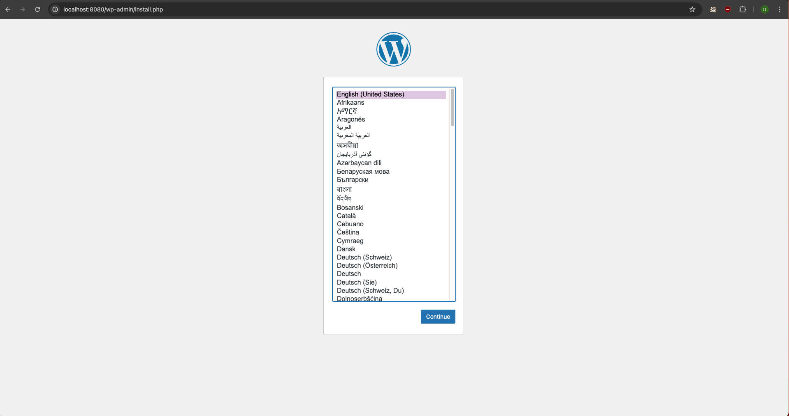
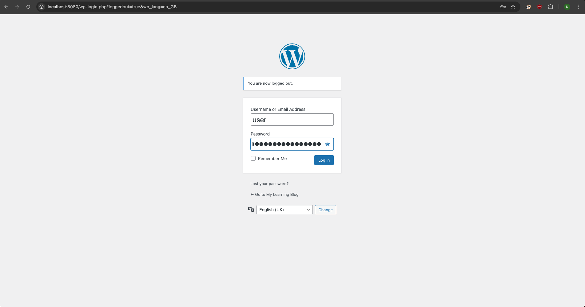
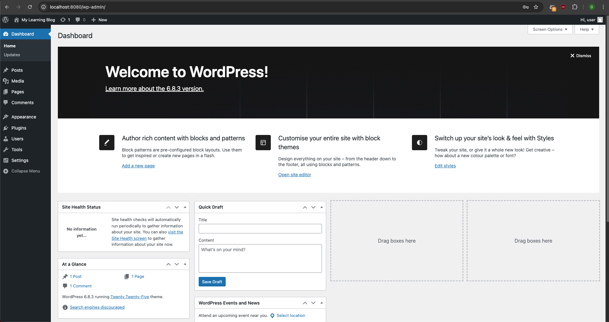
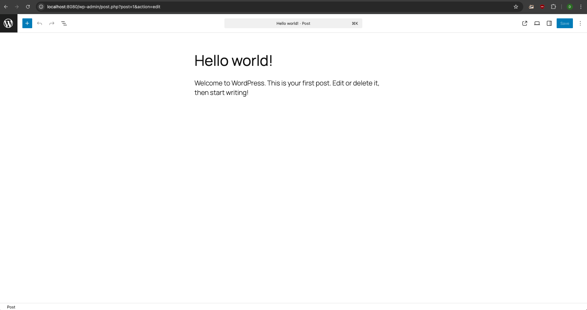
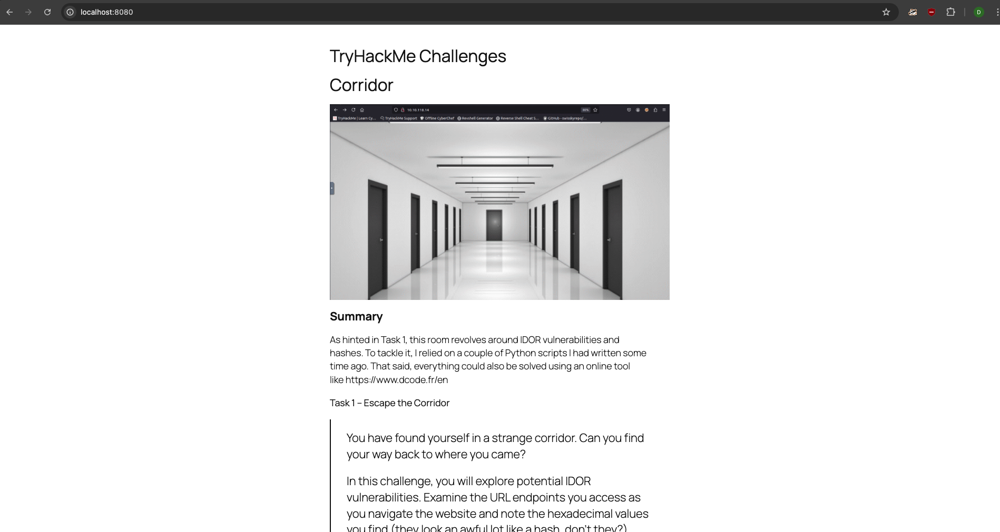

# Wordpress Blog with Docker
This repository contains the code and the steps needed deploy a WordPress site (eg. a personal blog), backed by a MySQL database.

Purpose of this project is to show how easily and quickly such a basic setup can be arranged using a **multi-container** configuration with Docker Compose.

This repository was created during my training at the ***Developer Academy***.

## Table of contents
- [Brief Note](#brief-note)
- [Quickstart](#quickstart)
  - [Prerequisites](#prerequisites)
  - [Connect to the Remote Machine](#connect-to-the-remote-machine)
  - [Clone the Repository](#clone-the-repository)
  - [Create and Setup the .env File](#create-and-setup-the-env-file)
  - [Start the WordPress Site](#start-the-wordpress-site-with-docker-compose)
- [Usage](#usage)
  - [WordPress Installation Wizard](#wordpress-wizard)
  - [Startup Behavior](#startup-behavior)
  - [.env File](#env-file)
  - [Logs](#logs)
  - [Data Persistency](#data-persistency)
  - [Useful Docker Commands](#useful-docker-commands)
- [Future Improvements: Road to a Secure Production Setup](#future-improvements-road-to-a-secure-production-setup)
---

## Brief Note
Docker provides official **WordPress** and **MySQL** images on Docker Hub.  
On the official Docker Hub page, a simple [Docker Compose example](https://hub.docker.com/_/wordpress) is already available and it works right out of the box.

For this project, that example served as a *canvas* and was modified to reflect the knowledge I have assimilated up to this point. 
The core setup, a WordPress service and a database service, remains unchanged.

> *The setup provided here is intentionally simple and accessible, designed to get WordPress running in just a few steps, even for users new to Docker.*

---

## Quickstart
### Prerequisites
- [Docker](https://docs.docker.com/engine/install/)
- [Docker Compose](https://docs.docker.com/compose/install/) 
- A terminal or shell environment of your choice
- SSH access to a remote machine (optional for cloud testing)

---

### Connect to the Remote Machine
```bash
ssh <user>@<remote_ip>
```
--- 

### Clone the Repository
```bash
git clone https://github.com/domenicoindrio/wordpress_docker.git
cd wordpress_docker/
```
---

### Create and Setup the `.env` File
Copy the [provided template](./config_template.env) and adjust it to your needs:

```bash
cp config_template.env .env
```
---

### Start the WordPress Site
```bash
docker compose up -d
```
Once the containers start successfully, your WordPress site should be reachable at:
- http://<remote_ip>:8080
- or at http://localhost:8080  

If everything worked correctly, you should see the **WordPress Installations wizard**.


## Usage
### WordPress Installation Wizard
After spinning up the containers, and navigating to it, the WordPress wizard will appear:

1. Choose a language:



2. Fill in the the required credentials and click `Install Wordpress`:


3. Log into your new WordPress site:



4. Welcome to your own WordPress Dashboard!



5. In the sidebar, open **Posts --> All Posts** to see your first automated **Hello World** post:



6. From there on, you can start adding your own posts:



> [!NOTE]
> After logging out, navigating to `http://<remote_ip>:8080` (or `http://localhost:8080`) will show the blog front page. To login again, visit `http://<remote_ip>:8080/wp-login.php` (or `http://localhost:8080/wp-login.php`).


### Startup Behavior
When you run:
```bash
docker compose up -d
```
- Both services (`db` and `wordpress`) are started simultaneously.
- WordPress waits for the database to be ready **before** completing its startup.
    This is controlled by:
    - The `depends_on` setting in `docker-compose.yml`
    - The `healtcheck` defined for the `db` service
- The WordPress container will attempt to connect to the database **only after the healthcheck reports it as healthy**.
- This ensures the installation wizard doesn't fail due to the database being unavailable at startup.

### .env file
The provided template is ready to use.  

For cloud or remote testing, you should:
- Replace defaults password with stronger ones.
- Restrict `.env` permissions:
    ```bash
    chmod 600 .env
    ```
- Uncomment and define **WordPress salts**

### Logs
To verify the startup process or debug issues:
- Follow logs in real time
```bash
docker compose logs -f
``` 

- Check a single service:
```bash
docker compose logs db
``` 

- Save the logs to a file:
```bash
docker compose logs wordpress > wp_log.txt
``` 

### Data Persistency 
Both the database and WordPress data (eg, media uploads, themes, etc..) are stored in **Docker volumes**, ensuring persistence across restarts, container recreation, or crashes.

### Useful Docker Commands Cheat Sheet
Here are some Docker Compose commands for different cases:  

1. **Simple restart (no configuration changes)**  
    Restart all running services without recreating containers:
    ```bash
    docker compose restart
    ```

2. **Recreate Containers (keep everything)**  
    Stops and recreates containers while preserving volumes, networks, images and logs.  
    Useful for edits to `.env` variables or Compose settings like port mapping, mounts, etc.:
    ```bash
    docker compose up -d --force-recreate
    ```

3. **Simple Reset**  
    Removes containers, networks and logs but keeps volumes and existing images. 
    Starts with fresh containers and network while preserving data:
    ```bash
    docker compose down && docker compose up -d
    ```    

4. **Full Reset (fresh start, keep images)**  
    Removes containers, networks, logs and volumes, but reuses existing images.  
    Starts everything clean, including new volumes:
    ```bash
    docker compose down -v && docker compose up -d
    ```

5. **Absolute Reset (fresh start, update images)**:  
    <u>Completely resets the setup</u>. Removes everything and pulls the latest images before starting fresh:
    ```bash
    docker compose down -v && docker compose pull && docker compose up -d
    ```

> [!TIP]  
> You can run these commands on single services, just append the `**<service_name>**`, eg.:
> ```bash
> docker compose restart wordpress
> ```

> [!NOTE]
> Docker Compose commands are scoped to the current project directory.
> To manage a project from anywhere, use the *project* `-p` flag followed by the project name, eg.:
> ```bash
> docker compose -p wordpress_docker restart
> ```


## Future Improvements: Road to a Secure Production Setup
This repository provides a fully working, basic starting point, that can be of course expanded into a modern and secure production environment.
For this goal, several enhancements should be implementes to ensure security and reliablity:

- Use strong, unique passwords for all credentials.
- Enable WordPress salts in the .env file.
- Apply firewall rules on the remote machine to restrict open ports.
- Add HTTPS encryption via a reverse proxy with automatic SSL certificates.
- Redirect HTTP → HTTPS for secure access.
- Schedule regular backups for volumes and databases.
- Keep all Docker images and packages up to date.
